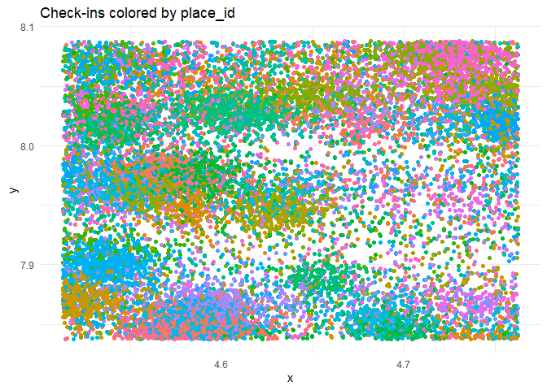
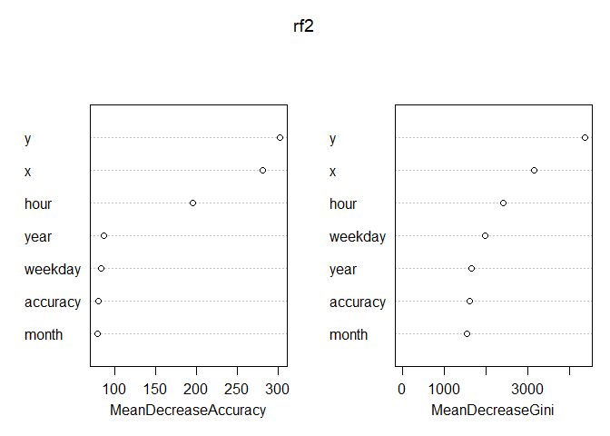
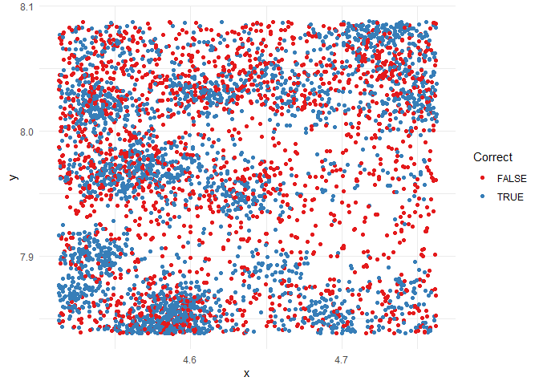

## Final Project: Comparing the KNN Model to Random Forest 

|     This Kaggle competition, created by Facebook, featured roughly 30 million Facebook user "check-ins" over a 100-kilometer squared area - 10 km by 10 km grid. The size of the data-set alone generated difficulties and lead to intricacies within the problem. We had yet to work with a classification model this large; for example, there were 100 thousand possible classifications for place_id.   


|      Continuing off of the place_id mention, this data-set is not easily interpretable, so it is worth elaborating on each of the six original variables. Place_id, as previously mentioned, is one of the 100,000 places someone could check in to in this ten by ten kilometer grid. Next is row_id is straightforward, the id for the number of rows within our data frame. Variables X and Y are coordinate positions that are between the values of 0 and 10. There are two final variables, accuracy and time, and both have been left intentionally vague. Accuracy is a series of values that range from 1 to 1,000.  


|     Now that there was a brief description of both the background of the data and the data-set itself, the data importing and cleaning process can begin.   


```r
library(data.table) #reading in the data
library(dplyr) #dataframe manipulation
library(ggplot2) #viz
library(ranger) #the random forest implementation
library(plotly) #3D plotting
library(tidyr) #dataframe manipulation
library(FNN) #k nearest neighbors algorithm
library(xgboost)
library(randomForest)
library(gbm)
library(caret)
```

## Loading and Cleaning:

```r
set.seed(2021)
fb <- fread(file = 'train.csv', integer64 = "character", showProgress = TRUE)
```

|       After importing the train data, the Kaggle notebook Team 13 analyzed decided to make a lazy data frame using the filter function in dplyr. The result is a more approachable data set with a .25 by .25 kilometer grid of the city. We opted to use a runif() instead of the Notebook's approach because the original, commented out, process lacked randomness and purely selected a grid based off of location in the city. Using a runif() we still generate a 250 by 250 meter area but can now justify it's dimensions for reasons other than just the Notebook selected them. 

```r
#fb <-fb %>% filter(x >1, x <1.25, y >2.5, y < 2.75)
#head(fb)

xseed <-runif(1,0,10)
yseed <- runif(1,0,10)
fb %>% filter(x >xseed, x <xseed+0.25, y >yseed, y < yseed+0.25) -> fb
head(fb, 3)
```

```
##    row_id      x      y accuracy   time   place_id
## 1:    886 4.7316 8.0394      136  20339 8606164520
## 2:   1284 4.5900 7.9726       25 516379 5571788666
## 3:   1939 4.6499 7.9592       54 590514 7454926561
```

|       The time variable was left vague, but the consensus within the Kaggle notebooks is the unit of time here is minutes. Time in minutes is now broken down into digestible metrics that coincide with business operating schedules. Minutes were translated to new variables: hour, weekday, month, year, and day. 


```r
fb$hour = (fb$time/60) %% 24
fb$weekday = (fb$time/(60*24)) %% 7
fb$month = (fb$time/(60*24*30)) %% 12 #month-ish
fb$year = fb$time/(60*24*365)
fb$day = fb$time/(60*24) %% 365
```


|       The final part of the cleaning and loading process is creating a train and validation set. The Kaggle Notebook that we are critiquing uses time as a method of splitting the data; Simultaneously, this validation structure is similar to how Kaggle initially split between a test and a train data-set, it is argued that this leaves the data exposed to seasonality bias. As a team, we thought the idea of creating a training set and a validation set off of time could lead to errors with seasonality so we decided to train the data using in the in class method of sample().
|       We decided to opt for a couple different methods of loading and cleaning the data that we believe have more efficacy. We will later compare our modeling results to that of the Notebooks as a check. 

```r
#small_train = fb[fb$time < 7.3e5,]
#small_val = fb[fb$time >= 7.3e5,]


train.indices <- sample(nrow(fb), nrow(fb) * .8)
train <- fb[train.indices]
test <- fb[-train.indices]
```

## Vizualizing the Training Set:


|Now we look at the data through ggplot and plot_ly


```r
ggplot(train, aes(x, y )) +
  geom_point(aes(color = place_id)) +
  theme_minimal() +
  theme(legend.position = "none") +
  ggtitle("Check-ins colored by place_id")
```


|       At first glance, the clusters are very apparent. Even with this Kaggle Notebook's unorthodox approach to dividing and creating a training set, there are still many noticeable regions for place_id.
|       The plot is a bit muddled, so the additional element of time is added in the following chart to avoid overlap. 

|       Trainz is created to show place_id check ins that appear 500 times. This is for the sake of readability because there are so many data points and adding a third dimension is unhelpful to visualize every place_id with a 3-D chart. 

```r
train %>% count(place_id) %>% filter(n > 500) -> ids
trainz = train[train$place_id %in% ids$place_id,]
```

| Although we have not touched upon it in class, the package plotly has simplified the creation of the 3-D graph. 


```r
attach(trainz)

plot_ly(x = ~x , y = ~y, z = ~hour, color = ~place_id,  type = "scatter3d", mode = "markers",
        marker=list(size= 5)) %>% layout(title = "Place_id's by position and Time of Day")
```
.png)
```
## Warning: `arrange_()` was deprecated in dplyr 0.7.0.
## Please use `arrange()` instead.
## See vignette('programming') for more help
```


| One of the most significant advantages of this graph is the ability to explore it manually. Viewing it from the side, you can see the ebb and flows of the check-ins throughout the day. If you go to a bird's eye perspective, you can see something that looks similar to the previous graph. On the key to the right, you can select or deselect the various place_ids. It's worth noting that the hour axis goes through the entire 24 hour period of a day.

|What if we want to look at the day of the week?


```r
plot_ly(x = ~x , y = ~y, z = ~weekday, color = place_id,  type = "scatter3d", mode = "markers", 
        marker=list(size = 5)) %>% layout(title = "Place_id's by position and Day of Week")
```
.png)

```r
detach(trainz)
```

|       Visualizing check-ins by week doesn't yield as much of a result as the hourly view of check-ins. That being said, there is still some variation that is worth nothing. 

|       Before the KNN models are used, the Notebook we analyzed noted that too many classes remained for something like a random forest to work effectively. 


```r
length(unique(trainz$place_id))
```

```
## [1] 7
```
| There are 982 classes for place_id, 770 classes that the Notebook had at this point, even with the heavily shrunk data. To combat this, the Notebook removed any place that didn't have fewer than three occurrences. This decision to do so seems reasonable as places with three or fewer check-ins serve little benefit in assisting with analysis. 


```r
train %>% count(place_id) %>% filter(n > 3) -> ids
train = train[train$place_id %in% ids$place_id,]
str(train)
```

```
## Classes 'data.table' and 'data.frame':	17062 obs. of  11 variables:
##  $ row_id  : int  17642664 11381678 16963901 11748370 22568437 26665388 2351236 28566229 8607542 5661536 ...
##  $ x       : num  4.62 4.65 4.61 4.72 4.64 ...
##  $ y       : num  7.96 7.97 7.85 8.08 7.89 ...
##  $ accuracy: int  42 169 60 2 60 73 80 13 71 19 ...
##  $ time    : int  459790 460576 655063 395018 629656 37112 531648 689217 468652 302945 ...
##  $ place_id: chr  "5456398388" "6783617234" "7361793486" "8771758468" ...
##  $ hour    : num  7.17 20.27 21.72 7.63 6.27 ...
##  $ weekday : num  4.3 4.84 6.9 1.32 3.26 ...
##  $ month   : num  10.64 10.66 3.16 9.14 2.58 ...
##  $ year    : num  0.875 0.876 1.246 0.752 1.198 ...
##  $ day     : num  1333 1335 1899 1145 1825 ...
##  - attr(*, ".internal.selfref")=<externalptr>
```

```r
length(unique(train$place_id))
```

```
## [1] 278
```
|       After 278 remaining classes and 17062 observations, we can finally begin the machine learning portion of the project. 

## K Knearest Neighbor: 
|       KNN is one of the most used method in the leading submissions, we first run a knn model using method from ML I

```r
train$place_id <- as.factor(train$place_id)
knnfit<-train(place_id~., data=train, method='knn', preProcess=c("center", "scale"))
```
```r
knnpred <- predict(knnfit, newdata=test)
mean(knnpred==test$place_id)
```

```
## [1] 0.4047883
```
|       The accuracy rate is 0.4054533 which is not ideal. We'll try the scaling the variables using Alexandru Papiu's method.


```r
s = 2
l = 125
w = 500

create_matrix = function(train) {
  cbind(s*train$y,
        train$x,
        train$hour/l,
        train$weekday/w,
        train$year/w,
        train$month/w,
        train$time/(w*60*24*7))
}

X = create_matrix(train)
X_val = create_matrix(test)
train$place_id <- as.factor(train$place_id)
model_knn = knn(train = X, test = X_val, cl = train$place_id, k = 15)

mean(test$place_id == model_knn)
```

```
## [1] 0.5311461
```
|       Our accuracy rate is 0.5311461 which is higher than the accuracy rate generated from Alexandru's data sampling method.

## Random Forest
|       We first examine Alexandru's random forest. (The accuracy rate from his data sampling was 0.5485545)

```r
set.seed(2021)
model_rf <- ranger(place_id ~ x + y + accuracy + hour + weekday + month + year,
                   train,
                   num.trees = 100,
                   write.forest = TRUE,
                   importance = "impurity")
```

```
## Growing trees.. Progress: 21%. Estimated remaining time: 2 minutes, 7 seconds.
## Growing trees.. Progress: 53%. Estimated remaining time: 1 minute, 0 seconds.
## Growing trees.. Progress: 85%. Estimated remaining time: 17 seconds.
```

```r
pred = predict(model_rf, test)
pred = pred$predictions
(accuracy = mean(pred == test$place_id))
```

```
## [1] 0.577699
```

|       His accuracy rate is 0.577699. We want to examine what is the best number of mtry so we are going to do an experiment.


```r
for(i in 1:7){
  fit =   fit = randomForest(place_id~x + y + accuracy + hour + weekday + month + year, 
               train, 
               num.trees = 100,
               mtry = i, 
               importance = TRUE)
  pred2 = predict(fit, test)
  cat('mtry=', i )
  print(mean(pred2 == test$place_id))
}
```

```
## mtry= 1[1] 0.562403
## mtry= 2[1] 0.5819109
## mtry= 3[1] 0.5754822
## mtry= 4[1] 0.5750388
## mtry= 5[1] 0.5683884
## mtry= 6[1] 0.5666149
## mtry= 7[1] 0.5581911
```

mtry = 2 produced the best accuracy 0.5819109, which would put us at 399th on the leaderboard, although we are only sampling a very small portion of the actual training set.


```r
rf2 <- randomForest(place_id~x + y + accuracy + hour + weekday + month + year, 
               train, 
               num.trees = 100,
               mtry = 2, 
               importance = TRUE)
importance(rf2)
```

```
<details>

##          1048543523 1055476101 1057426990 1079309834 1105136505 1133191058
## x          0.000000 -0.2773714  80.253774  2.5022763  14.027943  101.50343
## y          0.000000  1.0010015 107.378273  4.1645311  23.166453  220.30036
## accuracy   0.000000  0.0000000   4.798770 -0.1528653   6.043034   14.33637
## hour       0.000000 -2.6174855  58.553218 -0.2898100   5.425099   83.87317
## weekday    0.000000  1.0010015  24.505309  2.1102377   5.010989   38.92928
## month     -1.001002  0.0000000  10.376587  2.4682818   2.044381   17.95128
## year       0.000000  0.0000000   9.072187 -3.8047803   3.730939   35.60455
##          1185162807 1188537645 1221970569 1232361161 1252459768 1273667705
## x         0.3162594  26.905168  -1.001002  0.6590266  37.389780 -5.0207338
## y         1.7105892  22.017167   0.000000  3.1653747  46.506935  2.5467620
## accuracy -0.4121517   6.146326   0.000000  2.3597662   7.478713  0.4151312
## hour     -0.5775428  12.915345   0.000000  1.9725640  25.243191 -0.1984615
## weekday  -3.3185768   5.259716   0.000000  0.8343295  12.338085  0.8132357
## month    -1.3440623  10.684170   0.000000 -0.5694177  22.941702  1.9687481
## year     -0.9184367  18.023458   0.000000 -1.9688843  20.927895  0.8571433
##          1360294927 1404400623 1415899100 1523086124 1548372608 1565654991
## x         4.8918281   7.455494  3.4736009 12.3373991 -1.4470101   71.60392
## y         4.8475390   7.401550  4.3096879 20.8764266  0.6110753   83.69900
## accuracy  3.1204387   3.883929 -0.7445039  4.2197217  1.7105892   11.33917
## hour      1.9449600   2.140965  4.3336395  7.8929306 -1.5825527   48.07935
## weekday   2.2693273   3.779180  3.6906484  1.1147675 -1.9946879   24.30927
## month    -0.7066751   3.201744  3.5672427  0.8680662  0.8987516   12.28959
## year      1.2860030   3.445440  2.9733600  2.6317217  1.2592291   12.80115
##          1632494511 1656211222  1658904852 1659776668 1663632329 1698708976
## x         13.937580 59.1854677  1.83783247   1.158203  14.527901 10.4318563
## y         16.788943 64.5759288 -0.03268606   7.754581  14.286012 10.9716356
## accuracy   1.589325 11.5358248  1.53996858   4.389302   8.053972  6.1161344
## hour       9.959617 27.6507052 -3.60898953   4.175020   7.897285  0.7865452
## weekday   10.846765 13.4846888 -0.09843641   5.171960   6.520149  5.4689048
## month      5.974462  3.3410267  1.07529125   6.668201   5.055593  3.9974961
## year      10.687774  0.8235399  2.86437006   6.908961   5.522438  5.7532326
##          1730170138 1814845858 1830708368 1832312107 1857283741 1898687978
## x         2.3255861 -3.3113969   5.069151  10.970600   3.708937 43.3290195
## y         2.5163412  7.2788653   6.932612  13.979474   4.834144 48.5431991
## accuracy  0.0000000 -0.2140069   2.716392   2.912212   2.544417  9.6207410
## hour      0.9524637 -1.3430022   4.228669   6.692571   4.472290 32.1675859
## weekday   1.4747313  0.1929888   2.159710   6.790110   4.026714  5.1907951
## month     1.6890115 -3.1701245  -1.995830   7.661217   2.043346  0.6411839
## year     -0.9034341  1.9184196   2.024599  10.571988  -1.588016  2.4180570
##          1912080942 1936389086 1939786567 1946046867 1989052669 2051258898
## x          5.391338   7.084377 17.8946493  162.33705  3.7878910   0.000000
## y         15.711981   7.937266 41.4632121  170.18638  7.3685442   0.000000
## accuracy   5.531776   6.601042 -0.3537021   17.53866  5.9134026   0.000000
## hour      11.983081   3.932970 19.6557452   54.78022  5.3216843  -1.001002
## weekday   12.445396   3.888791 14.0279102   25.25044  0.6726181  -1.001002
## month      8.644037   3.028628  6.2841409   12.73823  3.8647273   0.000000
## year      11.221546   7.292105  6.8522206   11.77879  6.3932185   0.000000
##          2098934549  2121253648 2126355333 2127991854 2151387307 2251755143
## x          1.001002 -2.56463459  30.362769 10.1006361 34.8914113          0
## y          1.389425  0.73618874  30.411351 12.4085004 29.7249451          0
## accuracy   1.001002  1.40834896  13.496182  1.1794377  9.1683034          0
## hour      -2.636758  0.40636382  21.159118  2.5440456 24.0890218          0
## weekday   -1.118277  0.03507157   4.715722  2.4942242 10.7868296          0
## month     -1.001002  0.72799238  10.029151  0.9215558  1.7537385          0
## year       1.389425 -0.09491665  24.671079  0.9898950 -0.3620339          0
##          2286386025 2288833055 2318405362 2336736738 2357871620 2392375532
## x          0.000000   2.382062   8.519524          0  17.704607   6.790703
## y          0.000000   5.638545  14.025860          0  20.883823   7.652207
## accuracy   0.000000   1.531408  -1.488985          0   4.622383   3.193421
## hour      -1.417051   3.159669   4.247211          0  13.501724   5.807031
## weekday   -1.001002   4.706888   6.567397          0   9.690136   4.263816
## month     -1.001002   1.067436   2.726605          0  10.268430   3.317330
## year       0.000000   3.569630   6.038918          0   8.950026   1.672574
##          2413809753 2484787536 2515183008  2543880025 2598851893 2620884628
## x         21.465354  118.26493  1.3440623 11.32660596 -1.0010015 -0.3793649
## y         27.060517  119.78255 -1.0010015  7.60933243  1.0010015  1.0619789
## accuracy  18.098000   17.16150  1.0010015 -0.02574279 -0.5775428  1.3249002
## hour       8.029431   72.17106  0.0000000 10.50955854 -1.1948196 -1.0693675
## weekday    6.372148   32.93816 -0.6327087  9.70034840  1.0010015  0.3549135
## month      8.814025   10.20608  0.8170415  6.99788724 -1.0010015  0.0000000
## year      14.895321   12.96001  1.0010015  7.33706488  0.0000000  0.3234646
##          2662975505 2669630184 2690288392 2691177377 2693962172 2698210631
## x         2.9581259  54.457718   2.219061   94.00164   6.837857 -2.8032911
## y         1.7278087  52.318184   5.595201  123.85660   6.662413  1.1937767
## accuracy -0.9156703  18.911451   1.828383   33.49574  -1.637020  1.9715804
## hour      0.4765012  12.205619   3.060706  103.35116   6.916572  2.2080888
## weekday  -2.8873383   1.634967   2.387517   54.16312   6.449883 -1.0516125
## month     2.5926761  23.481767   2.112072   44.22399   5.281975 -0.4589281
## year      3.1241488  29.506947   3.713618   53.49999   6.650435  1.1848759
##          2753370971 2774116346 2810288879 2858933519 2858995387 2867831080
## x        -1.1485910   37.45169  -1.649348   8.289288  1.1089040  4.5647170
## y         1.3440623   32.11242   1.932241  16.890159  3.5433579  4.7411263
## accuracy  1.5753235   24.67341  -1.689012   1.641071  0.1764165  2.9516604
## hour      0.2390594   21.98330   2.389888   6.033134  2.7344190  5.0013673
## weekday   0.2294278   12.67160   1.132822   3.268161 -3.4168758  3.5024564
## month    -1.3894250   13.31132   2.187013   8.009584 -1.0707421 -0.4848385
## year      1.0010015   27.72832   2.636758  15.566502  2.3835870  1.5807408
##          2902825412 2923373193 2982832050 2990501501 3010861977 3012290098
## x         1.0325203 117.801303  121.54900  2.2954648  1.8600615  3.8269034
## y         1.6713157  98.743695  165.75189  8.3082998  4.3893018  4.5573042
## accuracy  1.6713157   8.505555   11.08930  0.9737872  3.2113471  2.7432295
## hour     -0.5775428  21.483757   85.66014  5.8506324  3.4136248  0.5721292
## weekday  -1.0010015  24.617083   21.31065  5.2370199 -0.1474861 -0.4065756
## month    -1.0010015  18.898911   15.60590  6.6345008  0.1318784  2.2362186
## year     -1.0010015  36.634616   10.24568  7.7937184  0.9840870  1.3025029
##          3013057658 3039275646 3082398160 3091699187 3173909240 3175161718
## x         101.88306 -0.1482276  1.5753235  0.9507318 -2.3376840   4.745658
## y         105.41625  8.5333149  0.3863199  7.9598530  3.0788538   6.501980
## accuracy   10.13563 -3.5694872  1.9792418  2.6920202  1.2966032   4.059773
## hour       77.45564 -0.8671809  1.3894250  0.9355126  0.5366562   3.335337
## weekday    18.52816  7.4155598  0.5791415  0.3618160 -1.7277549   3.494516
## month      13.46849  0.3420106 -1.0010015  2.4528650 -1.3847156   3.726753
## year       15.55475  0.3597300  1.6373653  6.4816421 -1.2245465   4.597182
##          3248798196 3256257029 3348032491 3383439068 3401323634 3425462912
## x         69.021122  -1.344062 -1.1634321 -0.3067876 15.9171894          0
## y         91.457394   0.000000  1.8968921  2.9423079 19.5972987          0
## accuracy   2.618336   0.000000  2.8153574  4.3532259  0.2517298          0
## hour      51.257121   0.000000 -1.3314225 -0.1563747 10.1941598          0
## weekday   51.152124   0.000000 -0.1717846 -1.4114377  8.3806555          0
## month     30.034323   0.000000 -0.1186798  1.8678573  7.9968139          0
## year      26.260293  -1.001002  1.6279859  1.9736718 11.2394954          0
##          3454489060 3458067827 3482908886 3506521577 3547841924 3560431083
## x         66.209734  35.859132  0.2950278  11.208877 -0.9371657  -1.001002
## y         66.305795  67.635649  6.9307320  12.030299  1.6990820   0.000000
## accuracy  64.407445  16.304726  3.2255536   7.852241 -0.9680020  -1.001002
## hour      32.653620  16.477714  0.3467719   7.551601  1.9687481  -1.344062
## weekday   17.175202   7.565502  0.2368902   6.577687  0.6180380   0.000000
## month      7.536929   4.601841  2.1943036   5.773399 -1.9165618   0.000000
## year       8.570365   6.173020  5.0811015  10.007075  1.6691101   0.000000
##          3596171617 3620558663 3642369670 3731939781 3746095815 3749403799
## x        -0.5469962  13.810292  0.7109824 17.6056590 -0.7963916 22.1159291
## y         5.4713042  14.890134  9.2522189 23.9562366  1.6359397 19.8307761
## accuracy -0.2567334   4.775573  0.7349283  2.1098808 -0.6404469 -0.4688923
## hour      2.3919859   7.038485  5.3755617 15.9593291  0.9936643  8.8325444
## weekday  -0.3313907   6.543012  2.9327155  7.2364230 -1.3290979  2.6929032
## month     1.7303245   9.092949  9.0355222  1.5960359 -2.3730011  4.1002247
## year      0.7561176   9.839325  8.5288494  0.4283864 -0.4686242 12.2792655
##          3754025541 3818273166 3902427426 3915062235 3986192033 4112268289
## x         0.1125102   0.000000  97.942810   19.97059  -1.344062 114.557916
## y         4.0254452   0.000000 132.138986   25.57451   0.000000 122.783016
## accuracy  1.6237379   0.000000  14.461375   14.29437   0.000000  16.867461
## hour     -4.6752016   0.000000  94.147528   12.44218   0.000000  51.311194
## weekday  -1.2050436  -1.001002  30.674160   10.34568  -1.702664  35.596767
## month     2.5797251   0.000000   9.295385   11.72950   0.000000   5.846687
## year      2.9957914   0.000000  11.599564   20.27103   0.000000   5.404970
##          4236321499 4257090543 4273914059 4323263939 4345935230 4369169679
## x          2.747291  137.84830  1.0010015   4.293007  7.1472194   85.41606
## y         30.300335  144.19347 -2.0860261   6.607657  9.3923858  131.85434
## accuracy  21.613370   43.72532  0.2524425   2.618640  1.2740470   22.33078
## hour      27.250397   86.41700 -0.8299724   4.786736  0.8402709   70.75294
## weekday   22.946049   43.10705  1.0010015   3.974028 -1.7582621   37.92137
## month     21.038141   15.16938 -1.0010015   5.456403  1.6854287   24.69631
## year      21.768548   22.95347 -1.0687085   5.329145  6.0251925   58.77732
##          4379572513 4401365867 4481517716 4506586646 4534134363 4596241074
## x          9.039062   3.051843   1.001002   0.000000 -1.3703558  126.58570
## y         10.605298   6.135863   1.637365  -1.001002  1.7871365  146.90882
## accuracy  -2.840972   5.573798   0.000000   0.000000  0.2294278   45.56042
## hour       8.357021   2.693484   0.000000   0.000000 -0.2504954   39.47771
## weekday    7.103821   1.255436   1.135354   0.000000  0.9184367   17.39274
## month      5.900248   2.143901   0.000000  -1.001002  2.3982920   19.29012
## year       8.842595   2.704948  -3.615846   0.000000  1.8966081   16.93628
##          4611813659 4734653313 4763914701 4809601058  4812950868 4849654424
## x         17.874604   7.700263  7.3246219  1.0988524 -0.23181268  1.6831090
## y         24.413363   8.800198  8.8078056  4.3456512  3.10952053  4.8609984
## accuracy   3.807008   3.738443  0.4192597  1.4609311  0.38872461  0.9794612
## hour      17.039094   6.611619  8.4642932 -0.8427743  3.67810241  4.1393977
## weekday   10.207166   6.971783  4.1001626 -0.5500025  3.31961043  4.1269396
## month      5.138369   7.722029  4.6420951  1.3824265 -0.06788474  4.2402893
## year       4.392989   7.526960  4.2849681  3.1221237  1.11516443  5.1544701
##          4877004227 4951821308 4984348364 4997435298 4998282173 5014401375
## x         49.926251 11.0775752   1.001002   5.626757 44.0219522  37.725633
## y         60.807064 30.0116076   1.904234   6.004219 50.8982676  40.914713
## accuracy  12.086182  8.7513091  -1.001002   2.965181 11.5574544   8.667392
## hour      33.530830 18.5854170  -2.120044   4.186688 22.5478653  27.202812
## weekday   12.800935 17.4796663   1.671316  -3.054059 19.5476629   3.428768
## month      6.074899  1.5924576   1.637365   3.085498  2.2288252   2.398559
## year       7.904022 -0.1753393   1.417051   5.184758 -0.6161021   4.801218
##          5051587485 5074230707 5086776815 5163772206 5174111854  5260787998
## x          1.649955   5.089454 -1.1727050  0.8122213  26.901906  5.15378324
## y          1.443977  23.102142 -0.1458681  1.3327348  32.004694  5.39037736
## accuracy   1.530533  -1.631577 -1.0923907  2.1906294   4.178194  0.34223303
## hour       2.511851  16.498957  0.4686242 -0.3722315  21.006418  1.03613481
## weekday    1.500276  12.410288 -1.4027521  1.8810174  11.651394  2.66991737
## month     -1.086211   4.283969  0.0000000  0.7629365  11.439944 -1.23907715
## year       1.732998   1.682804 -0.3846723 -2.7281608  19.245738 -0.05976164
##          5263947626 5275104581 5306355160 5338585618 5367646589 5378047583
## x         1.4672404  2.5224107  13.971818   0.000000  57.881278   4.997867
## y         1.0552657  3.0927889  12.114440   0.000000  48.843092   4.757048
## accuracy  0.6850528 -3.8313282   9.210529   0.000000   7.256987   4.033191
## hour      0.1682493  2.0262598  11.032527  -1.001002  40.240119   3.362777
## weekday   0.9315285  2.1200444   9.089262   0.000000  15.745411   3.187621
## month     0.9279707  1.9540761  10.181965   0.000000   3.767616   3.744154
## year     -1.0612102 -0.8457586  11.913133  -1.001002   2.823674  -2.142923
##          5452615310 5456398388 5563514301 5571788666  5572473242 5582617707
## x        19.9111496  48.483801  35.825899   6.717247  0.94017336  11.980232
## y        14.6439668  54.024721  30.864853  16.039060  3.45635098  12.716389
## accuracy  0.8549123  13.439810   4.558119  10.250942 -1.19264036   3.100515
## hour     15.4353392   6.691820  18.505451  15.714836  1.70896784  10.638671
## weekday   0.8067121   5.250300   4.756091  13.917464 -0.75999064   7.477029
## month     3.0041477   2.880529   8.466559  12.100156 -0.06821959   3.108328
## year      1.5670451   3.151505   8.648982  15.567275  3.17643582   2.973321
##          5584893243 5588261539  5589060688 5664468785 5720265425 5743878018
## x         1.2669398  1.5882272 -3.33041510 -0.2103249  0.8633049 125.319643
## y         1.4170505  2.0385660 16.78047152 11.1567826  1.5753235 140.617330
## accuracy -1.9883796  1.1113620  5.49756723  4.1476942  1.5753235  19.237720
## hour     -0.8170415  0.7957298 -0.05491857  3.2391496 -0.1601323  76.706691
## weekday  -2.8363631 -0.2000080  0.88633437  1.1016271  0.0000000  21.630332
## month    -0.2294278 -1.6452007  9.04115575  3.5155944  1.2669398   8.495360
## year      1.4828407 -0.1280390 13.41044319  8.0153549  1.3440623   8.848968
##          5755917104 5784265271 5820183825 5848157417 5909932114 5912227871
## x         20.383656  1.6373653  0.8313211  4.6261638  2.6244317  51.483008
## y         22.695007  1.6373653  2.4310832  3.4744736  3.8138996  49.960555
## accuracy   3.162413  0.0000000 -1.7105892  1.9850633  1.1136089  20.288306
## hour       5.592796  0.7074606  2.0512252 -2.8674904 -0.3033248  37.159194
## weekday    7.460186  1.6373653  1.6921475 -0.8001109 -0.7442642  30.864790
## month      4.631989 -1.0010015  0.4927843  0.7356179  3.3729625   3.108268
## year       5.944768  1.6373653 -0.5253707  2.2962884  3.1112161   2.469190
##          5920973090 5954998160 5988831890 6039249166 6048881030 6053121487
## x         12.291216          0 -3.4564486  114.22643  2.2245214  -1.710589
## y         20.661404          0  1.7200523  124.64628  1.8150179  -1.001002
## accuracy  -1.796608          0  1.9446423   13.99306 -0.3780185   0.000000
## hour      16.325063          0  0.7246662   63.20519 -1.2669398  -1.834322
## weekday    7.629433          0 -1.9446423   31.51052  0.8534238   0.000000
## month     17.270404          0 -1.6042011   10.80237  1.7105892   0.000000
## year      14.364421          0 -1.6822247   10.77402  1.9834152  -1.417051
##          6069125859 6069562434  6119443378 6139076809 6213456602 6227624244
## x         138.02984 10.3290003 -0.66346762  0.2884112  11.568691  1.4422391
## y         294.15259 12.6760205  1.63736531  4.8748542  15.338622  5.5313639
## accuracy   14.80397 -0.8214836 -0.06441593 -0.7149337   2.446870  2.6581105
## hour       84.06028  8.8812812 -1.66546361  1.7920770   7.260727  2.7238843
## weekday    74.74228  3.9721961 -1.15935668 -1.4319621   9.513075  3.0180833
## month      18.25791  0.3199911 -1.37457856 -0.9072171   4.581334 -0.3686313
## year       21.14692  0.9854746  0.28207372  2.2426234   1.960858  1.4446485
##          6269047739 6333801857 6340771987 6347470048 6433759695 6437082746
## x         10.651342  177.21795    7.17709 22.3925617  3.1663144  4.0603467
## y         10.131403  229.31809   63.81692 21.3962159  3.2898342  2.4043820
## accuracy   4.727527   16.16999   17.15763  4.3910738  3.0906069  3.2441497
## hour       4.927785  104.13592   48.84610  2.0675978  1.8011467 -0.1041954
## weekday    8.431929   37.72815   27.59062  5.5176687  0.7280192  3.3499079
## month      6.432885   17.56417   35.44585 -0.3724572 -0.5684000  3.2876606
## year       9.128346   16.41220   54.46261  2.5084136  3.0948674  3.4939523
##          6483874559 6493056622  6508507130 6591445738 6603087507 6682200693
## x         23.986933  2.1494174  0.21073423  47.765531 39.0836740  30.794001
## y         21.138689  4.5182820  2.37364904  64.918246 48.2747801  52.727362
## accuracy   2.881187  4.7018427 -0.39398044   1.226528  7.3347715  12.876660
## hour      17.123357  5.6502390 -0.07432983  17.093653 21.0718448  31.347232
## weekday   13.247340  3.7143148 -2.25394488  13.355858  6.1998124  16.018590
## month     13.563351  0.3369649  0.34530237  11.651630  2.1049723   2.481478
## year      19.239842  1.8239064  1.44850157   8.057330 -0.4345346   4.571904
##          6706069581 6767341052 6783617234 6787119132 6790656215 6849802206
## x        121.759203  0.8061328   28.73663   9.444734   6.716909  36.092164
## y         93.450384  2.4193898   48.98650  12.011103   7.990626  37.334697
## accuracy  33.514677 -1.0130868   12.02175   8.353849   5.482481   4.171400
## hour      56.339487  0.3688458   30.60326  10.542069   4.236925  28.437939
## weekday    9.270187  0.2127176   28.22470   9.887184   1.765299  22.558184
## month      7.682039 -0.3492577   36.92414  10.490182   4.888014  10.965040
## year      11.039290  1.4637194   34.54196  10.673455   7.534830   7.464818
##          6859843257 6975717826  7033274685 7035357909 7037268168 7056287821
## x                 0  7.1953461 -0.09164441  2.1932961   4.833292 -1.0369781
## y                 0 10.9428260  3.91845118  2.0080483   9.829234  2.9992225
## accuracy          0 -0.9135116 -1.57439959  1.7372705   4.533273  0.4264790
## hour              0 -1.7613625 -0.89069270 -5.4208563   6.931891  2.0202407
## weekday           0  0.9128702  0.49088899  0.3922926   1.926188  1.0749911
## month             0 -2.1302910  1.40069406  1.9488101   4.294292  0.4648584
## year              0  0.5774357  0.67965822  1.4170505   6.702991  0.8567233
##          7098575067 7161268689 7244846825 7256177706 7263618220 7277986523
## x         35.419342  -1.001002   1.007255  0.8710484 -1.0010015   3.056602
## y         45.575661  -1.001002   6.583313  2.9837446  1.0010015   7.472343
## accuracy  18.916684  -1.001002  -1.600578  1.2009792 -0.4473031   1.631808
## hour      22.168976   0.000000   4.851959  0.4904222  1.0010015   2.938267
## weekday   10.296620   0.000000   3.468080  0.6067016 -1.3894250   6.210455
## month      2.443126   0.000000   4.682938  1.7026641 -1.0010015   5.587872
## year      13.694350   0.000000   5.911061  0.3037564  0.0000000   4.448813
##          7344924846  7356540900 7361793486 7383552758 7415061214 7423639918
## x        -3.0659756 -0.80217217   85.22788  67.097552  3.6064119  29.763293
## y         5.4983940  2.89135501  126.21915  71.446463  5.7331096  33.074032
## accuracy -1.7966661 -0.73659762   14.72333   9.246211  0.1726196   3.899714
## hour      2.5234921 -0.07996833   26.37959  59.604090  2.9755725  16.778862
## weekday   0.3034057 -0.92664080   13.05331  34.193788  3.3379548   7.399313
## month     2.7495681  0.67555598   11.63511  13.245600  5.0191868   5.056709
## year     -0.2424557 -0.41925588   17.04824  56.212330  1.7942583   5.002542
##          7454926561 7521523932 7545652958 7571372232 7638817463 7638936413
## x         32.314873 -3.4375718  -1.266940 -1.8575860   8.895972  1.3010813
## y         36.993945  1.0010015   0.000000  1.3197241  11.842180  3.0493574
## accuracy   1.326763  1.4170505   0.000000  1.7244736   8.100909 -1.0283531
## hour      22.276052 -0.2425499   0.000000 -2.3456254  10.254046  0.9297617
## weekday    8.607036  0.2773714   0.000000 -0.1023654  10.908608 -0.4686988
## month     15.502639  1.4170505  -1.001002  0.9722035   8.742672  0.3290012
## year      17.674860 -1.0516125  -1.001002  0.1740829   7.596729 -0.6945380
##          7661728758 7674091249 7675133327  7703074997 7738779234 7796832653
## x          2.227373  -1.001002   16.35286  1.11827662  2.9439217   6.536168
## y         15.290541   1.001002   65.49251 -0.08669835  4.2284117   6.385516
## accuracy   3.562891   0.000000   20.69301  1.72005229  2.6036547   2.764874
## hour       4.631758   1.001002   28.33243  2.43925638  1.5651745   3.504051
## weekday    6.011470  -1.001002   25.63943  2.37300108 -1.2911378   2.652510
## month     13.182462   0.000000   39.20883 -2.00489617  0.2136662   3.216790
## year      10.996640   1.001002   42.34941  0.20000800  0.5441595   3.896302
##          7797861810 7888763516 7926287420 7929419504  7940364759 7953051199
## x          0.000000  2.1126689   0.104100  0.4430150 37.66838613   0.092403
## y          0.000000  4.7324639   2.965977 -0.6404469 41.19765599  15.829945
## accuracy   0.000000 -1.9319024   2.028613 -2.3579848  9.74817177   1.896236
## hour       0.000000  2.3110997  -1.791586  1.7946063 40.12714068   9.218967
## weekday    0.000000  0.2063518  -1.037758  0.2000080 12.59377434   3.892228
## month      0.000000 -2.0809834   1.426198  1.6100678  1.49963499   3.804895
## year      -1.001002 -1.4347462  -1.055103  1.4576326  0.03552227  11.091648
##          7974821040 7996062479 7999097786 8066670278 8071068551 8107013203
## x         0.8523056  13.271297  4.3541070 -1.2523636  1.8919218  28.864023
## y        35.6880162  19.092443  4.9832100  9.0038676  7.5724487  34.234651
## accuracy  5.9078515  12.767861 -0.8078162  3.3011880  0.8798574   8.341193
## hour     14.0962946  15.700049  4.2108232 -0.5914002  7.0922236  17.777741
## weekday  22.3140149   6.465977  5.2776890 -3.6655354  3.0046697  19.447398
## month    16.5761707   8.403098  3.3758519  0.7083308  2.8430929   2.311832
## year     15.5033359  10.860714  5.5532771  3.6771349  1.2048432  18.634037
##          8161057983 8208108941 8223383173 8294678496  8295012801 8310961109
## x         50.829981  -3.714325  73.614344  -2.642133 -0.29194954   5.727486
## y         44.597438   4.624038  68.840851   0.000000 13.66259043   5.414990
## accuracy   2.847102   3.487044  21.820746   0.000000  0.07341062   5.057450
## hour      37.512272  -0.658795  22.008118  -2.224521  6.76850945   3.451309
## weekday   21.188529  -2.853258   1.548800  -1.702664 -1.00797395   3.898036
## month     11.476035  -1.955368   3.191750   0.000000  5.70300579   3.621874
## year      17.302406   3.559646   9.258588   0.000000  0.27372773   3.944221
##          8383124021 8424179985 8470680096 8476701258 8570520632  8571578216
## x          2.644429   9.166298   8.734868  57.242518   6.780617 -0.04726785
## y          3.545864  10.349676  19.042175  71.726687  20.717439  5.11422899
## accuracy   2.021469  10.129489   9.206438  11.696777   2.780636 -0.58921294
## hour       2.456974   9.127078  14.431394  51.105304  11.166448 -5.81131881
## weekday    1.001002   5.272293   6.358975  30.774762  12.674686 -0.03564777
## month      1.416205   7.368774  10.052239   3.558315   8.853678  2.03582034
## year       2.872368   9.873112  14.172749   9.739709  14.312287  3.60154972
##          8574752885 8606164520 8644792847 8696502867 8771758468 8799852226
## x         62.057285  60.785118  2.1738587  6.7736471  156.61812 -2.7166466
## y         59.589028  58.088910  2.9463787  6.9447666  193.07337  2.1200444
## accuracy   5.615799  19.226416 -0.5448665  1.4360663   10.18883  0.5775428
## hour      21.070963  35.267003  1.6775579  0.7463367   95.17933 -1.6027116
## weekday    9.374195   8.984093  1.2669398  0.6532921   12.70605 -0.2773714
## month      5.968997  20.377485 -1.0010015  2.9922582   12.41197  2.1300716
## year      16.350108  29.931496  1.7026641  7.4843732   20.87762  0.2747419
##           8942917641 8948237890 8970231935 8993387832 8994297689 9001204909
## x         1.25669402  1.0010015  15.279659  4.4526099   2.208089   0.000000
## y         2.31777162  1.3440623  19.412324 10.1320060   2.201483  -1.001002
## accuracy  1.00100150  0.0000000   7.355586  7.4313108   1.702664  -1.001002
## hour      0.05352893 -2.1479316  13.297433  6.4529963  -2.495398  -1.001002
## weekday  -0.68132127 -0.4473031   2.782295  6.3851764  -2.229805   0.000000
## month    -1.91939817  0.0000000   1.215814 -0.5136157  -1.637365   0.000000
## year      1.99468791  1.3440623   6.644661  3.2904017   1.702664   0.000000
##          9050699095 9062985866 9069123626 9139246519 9229282356 9241746937
## x           0.00000  1.0010015  26.517154  2.8778551  44.528465 -0.9911197
## y           0.00000  1.0010015  31.185874  3.7891005  59.096846  1.4027521
## accuracy   -1.26694  0.0000000   6.083898  0.8498484   6.675494  1.4027521
## hour        0.00000 -0.3333704  19.124313 -2.9011014  30.348462 -2.0048962
## weekday     0.00000  0.0000000  25.025911 -0.3362146   8.872281 -1.3076582
## month       0.00000  0.0000000   5.474893  1.1678062  12.062323 -1.0010015
## year        0.00000  1.0010015   5.116370  2.6739432  35.986052  0.1280390
##          9310585226 9320329836 9349897179 9353685142 9387282069 9497216146
## x        -0.4398805 -0.2729177  5.3673161  -1.955622 -1.1389324  -3.122427
## y        -0.3841673  4.0169734  9.4919658   5.292375  2.3799960   4.232743
## accuracy  1.3894250  2.8684888  0.9886467   1.399273 -1.9246063   2.437065
## hour     -1.6373653 -3.2345160  6.2119268   2.646030  0.1644050   2.701643
## weekday  -1.6359397 -1.6184710  1.6163045   2.833461 -1.2436933   3.598091
## month     0.0000000 -1.3641541  1.4529296   3.475763  2.3374994   2.419523
## year      0.2000080  2.2117002  1.9065890   4.200050 -0.8590752   3.243933
##          9583870819 9584750042 9688501177 9689861163 9692180720 9724025170
## x         22.898866  11.350419 1.80991632  22.997351   1.001002   0.000000
## y         35.028358  21.400902 3.09995026  27.704078  -1.001002   0.000000
## accuracy  15.349529   4.053495 2.63481133  11.170402   1.001002   0.000000
## hour       8.244055   7.465289 0.82518244  14.070220  -1.389425  -1.266940
## weekday    7.791665   7.922378 0.78592800   8.580824   0.000000  -1.344062
## month     11.704140   8.906735 2.00489617  15.956070   1.001002   0.000000
## year      26.189931  18.058439 0.05248653  22.905556  -1.001002  -1.001002
##          9735625432 9762192297 9764427790 9770292001 9773231984 9819467920
## x         97.268644  17.987391   22.35480  97.966557  36.747453  4.9401419
## y        141.894722  28.170113   64.83785  88.564396  60.414619  5.0745515
## accuracy   7.230221   4.334201   10.19867  25.058706  10.480450  3.7811683
## hour      82.541801  18.018912   21.23730  51.053362  14.089452  0.8502047
## weekday   38.617857   7.080590   25.37040  30.946902   7.784932  3.1484445
## month      8.457457   4.503067   26.47740   7.870437  10.188517 -1.9779694
## year       7.162396   4.337374   32.42444  10.215331   4.645737  3.0729667
##          9886575116 9935335664 MeanDecreaseAccuracy MeanDecreaseGini
## x        -0.2773714   9.764576            281.15795         3149.395
## y         1.6373653  30.810601            302.25469         4372.442
## accuracy  1.0010015  22.848931             79.91593         1614.793
## hour     -2.4310832  19.582391            195.33624         2418.817
## weekday  -1.3894250  14.681894             82.88793         1980.289
## month     1.1353541  18.686705             78.19218         1547.349
## year      1.3440623  25.841835             85.74285         1661.708
```
</details>


```r
varImpPlot(rf2)
```


|       X and Y coordinates are the most important variables. The 'accuracy' variable is among the least important.


```r
test$Correct = (pred == test$place_id)

ggplot(test, aes(x, y )) +
    geom_point(aes(color = Correct)) + 
    theme_minimal() +
    scale_color_brewer(palette = "Set1")
```


|    The correct predictions are more clustered than the wrong predictions.

